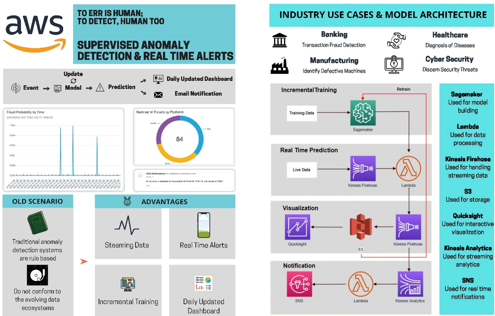
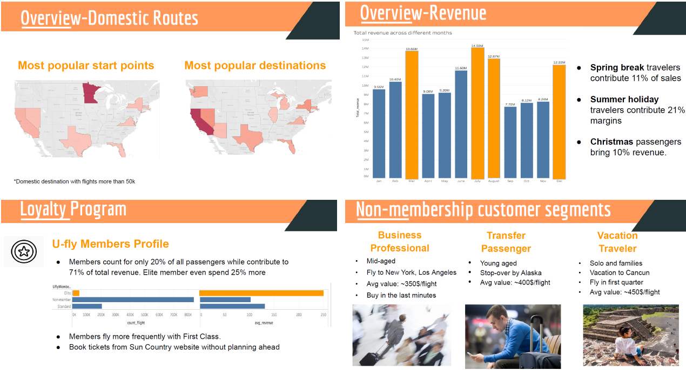
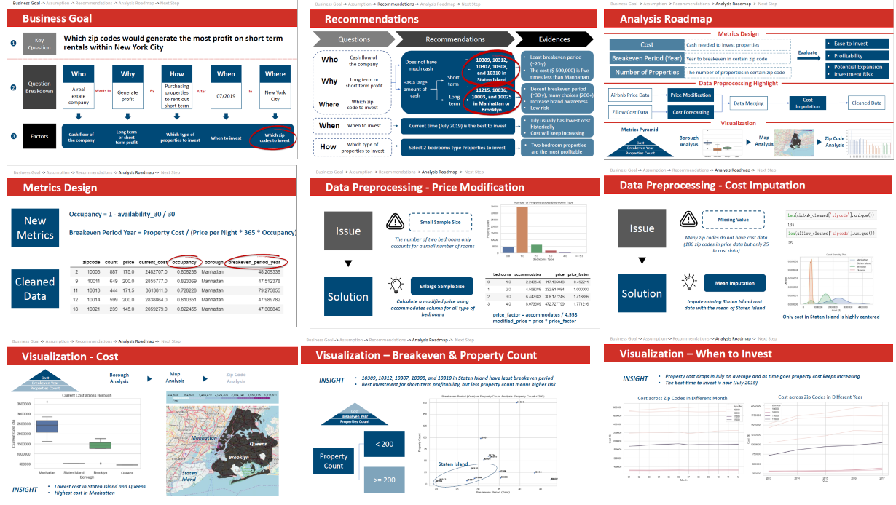
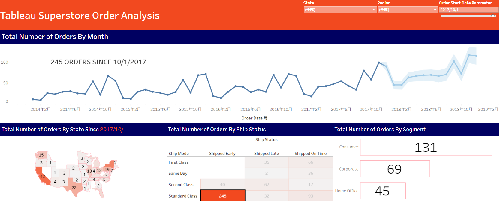

# Intro

Hi, I am Chuchen Xiong. I obtained my Master of Science in Business Analytics from the Carlson School of Management, University of Minnesota. In the gap year after my college, I was interested in using data to explore the unknown, tell a story, and make an impact when I was an intern in China Merchant Bank and Accenture Strategy. In the UMN MSBA program, I built a database, gathered open-source data, performed analysis, and gave presentations when I worked with real clients including Mall of America, a leading entertainment company, and a governmental organization. Now, I am looking for a Data Scientist or a Data Analyst role. Driven by curiosity and empathy, I look forward to using my analytics skills to make an impact in the future.

---

# Project Portfolio

## Data Science

### Real Time Fraud Dectection using AWS
*AWS S3, SageMaker, Kinesis, QuickSight, SNS*

 

Anomaly detection is a technique used to identify rare items, events, or observations which raise suspicion by differing significantly from most of the data you are analyzing. There are a wide range of applications in different industries including abnormal purchases in retail, cyber intrusions in banking, fraudulent claims in insurance, unusual machine behavior in manufacturing, and even detecting strange patterns in network traffic that could signal an intrusion. Leveraging a solution provided by [aws](https://s3.amazonaws.com/solutions-reference/fraud-detection-using-machine-learning/latest/fraud-detection-using-machine-learning.pdf), I developed an end-to-end anomaly detection workflow starting from data streaming to dashboarding. 

---

### Soccer Analytics using Association Rules
*Association Rules, Exploratory Data Analysis*

This analysis helps the Liverpool to perform better and find patterns that tangibly contribute the clubs success using historical data. I tried to explore the win probability from the betting odd and avoid losing in high probability win matches. Further, I understood what factor-like home v away, player stats and stage a˙ect our lose or draw in high probability win matches. Finally, I suggest improvement in the lineup i.e. in terms of defense, midfield and forwards for Liverpool F.C. for these high probability games.

---

### Home Credit Default Risk Prediction
*LightGBM, XGboost, Random Forest, Stacking, Feature Selection (PCA, correlation, feature importance)*

 

Currently, Home Credit relies on applicants’ external credit history with statistical and machine learning methods to drive lending decisions. While existing model proves to be effective, Home Credit wants to further discover hidden traits in their data to unlock its full potential. With the combination of each consumer’s Credit Bureau and previous Home Credit application data, I conducted Logistic Regression, Random Forest, XGBoost and LightGBM to help the company develop an enhanced prediction model that would lead to more concise and intelligence conclusions. With the implementation of our prediction model, Home Credit can further expand financial inclusion for the unbanked population and create a win-win situation for both parties.

---

### Customer Segmentation for Airlines
*Clustering, RFM Model, Churn Analysis, Customer Segmentation*

 

Hired by the analytics team of a leading Midwest Airlines, our motivation is to better understand their customers and address the challenges they face using historical data, to elevate customer experience and generate higher revenue. Specifically, our team are going to develop a clear and robust picture of different segments of client's customers. We are interested in understanding if our Rewards programs are beneficially and how we can better exploit its benefits as a customer and airlines. To address the question, we do cluster analysis on the Non-menberships’ data, which contains lots of useful information like total amount one person contribute, flight frequency, the number of average days one person book their flights in advance, booking channel, etc. In this way, we could furthermore explore which segment of Non-menberships customer is more suitable for converting into menbership customer.

---

### Impact of Repeated Marketing
*Causal Inference, Matching (PSM), Treatment Effect, Exploratory Data Analysis*

 

Here is a causal inference project via Econometrics. A Portuguese banking institution conducts a direct marketing campaign using phone calls to promote subscription to a term deposit at their institution. Often reminding people about availability of such services and its providers is important to drive sales. As each incremental phone call costs them time and money, while not placing the promotional phone call to prospective clients might cause them to lose out on that customer. Hence, they need to identify the right amount of phone calls per prospective client to drive subscription to term deposit. To aid with the above effort, I will run an analysis to detect the effect (positive/negative) of making over 2 phone calls compared to making just one or two phone calls.

---

### NYC Housing Investment Anlaysis
*Time Series Forecasting, Data Manipulation*

 

We are consulting for a real estate company that has a niche in purchasing properties to rent out short-term as part of their business model specifically within New York City. The real estate company has engaged our firm to build out a data product and provide us with conclusions to help them understand which zip codes would generate the most profit on short term rentals within New York City. Here I used Breakeven Period Year and property count as two metrics to evaluate each property. Finally, several zip code areas are recommended according to the client's company size, return period, and cashflow.

---

### Coffee Shop Sales Exploration
*Retention Analysis, Promotion Plan*

Central Park is a boutique co˙ee shop located in the heart of New York City. It serves a high-quality selection of co˙ee, food, tea and etc for customers. They believe their current customer base is fairly loyal and revenue are generating steadily year over year. Now, as the size of its customer base has reached more than 30K+, the store would like to explore their sales data and have a sense of their demands and customers. Hired as the data scientist consultants, our motivation is to better understand the customer purchase patterns of volume and items sold in the store, confirm whether their customer base is loyal with support from sales data, and smooth demands out over time.

---

## Visualization

### Data behind 'The Last Dance'

The Last Dance is a sports documentary series about Michael Jordan produced by ESPN and Netflix. The series mainly focuses on Michael Jordan's last season with Bulls (1997-1998) and take down the process of Chicago Bulls' third consecutive championship. Contracts dispute, trading rumors, players' aging, bad relationship of general manager Jerry Krause and coach Phil Jackson. These factors became a dark cloud for the Bulls' third consecutive championship... It is also the reason why Phil called it 'The Last Dance'. This dashboard walks you through the data behind 1997-1998 Chicago Bulls to elaborate Michael Jordan's tough journey to the championship. 

---

### Store Order Analysis

Using Tableau Superstore data, I created a dashboard to show the number of order by month and predicted future orders. Number of orders by states, ship status, and segment can easily help stakeholders understand what happened and make a decision based on the data.

---

© 2020 Chuchen Xiong. Powered by Jekyll and the Minimal Theme.

