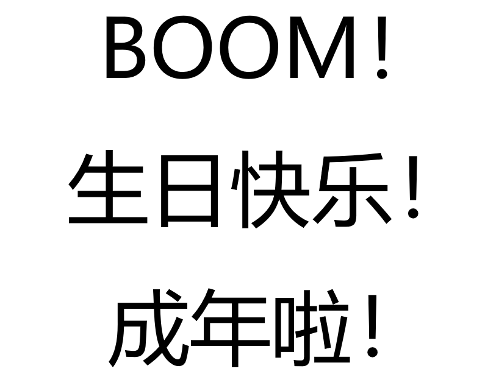
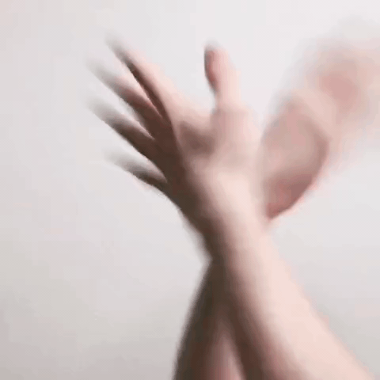
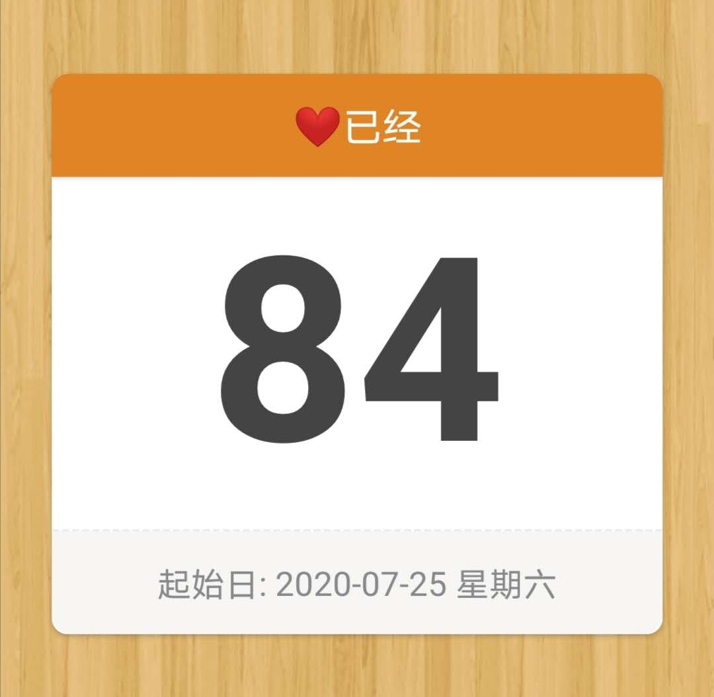

该秀的才艺还是得秀的

我觉得18岁是人生中最重要的时刻，想想我自己当时好像也没怎么过，但是真的很开心我能在你18岁的时候，我也想我能做什么让你觉得这天有意义而且值得纪念，不在一起真的很难受，不能和你一起在同一个时间和空间，一起做一件事情，我想了想，然后做了这个网站，我们可以一起打开，看到的是一样的，而且也不会消失，只用一个链接，就可以打开，虽然开起来没有很高大上很酷炫，也很理工直男，但是它一直都在呢！我们两都可以触及，而且随时可以看，是不是很方便。（自己给自己找理由还是不错的）

不知不觉已经过了84天啦，时间过得好快，我还记得第一天遇到你，我还在扮演一个小孩，现在想想都觉得很搞笑，但是想想，我心里其实就挺小孩的，和你在一起待着，觉得自己就是真实的自己，和自然而然地很舒服，我觉得这就是最舒适的关系吧。

一开始，我还挺惊讶的，会唱歌，会日语，还会画画，还时不时发一些照片撩人，怎么这么多才多艺，慢慢了解，我发现你还挺成熟，会考虑很多事情，而且也知道我在想什么，也会站在我的角度，我能真真切切地感受到那份喜欢，很真实很真诚很纯粹。

你之前说过你之前的经历，很多在乎的事情你都能想起来那些细节，我觉得你真的很细腻，和你一起过日子会很有仪式感，在生活中印刻下痕迹。后面你去朋友那边玩，我真的很羡慕她，真的。玩的这几天你能记录下在一起的每一分每一秒，和你在一起真的很温暖治愈。

我很喜欢你在表达自己看法，思考，或者态度的时候，真的感觉很有魅力，那时候自己感觉就像一个小迷弟。你给我看之前写的日记和对一些事情的看法，包括对身边室友花痴的态度，都感觉你在闪光，

