

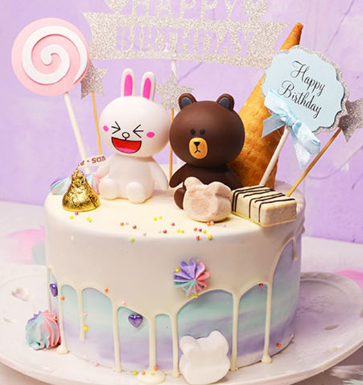

### 闭上眼睛！现在！许三个愿望！！！

### 该秀的才艺还是得秀的，成年的第一天送出一朵花！

---

我觉得18岁是人生中最重要的时刻，想想我自己当时好像也没怎么过，但是真的很开心我能在你18岁的时候，我也想我能做什么让你觉得这天有意义而且值得纪念，不在一起真的很难受，不能和你一起在同一个时间和空间，一起做一件事情，我想了想，然后做了这个网站，我们可以一起打开，看到的是一样的，而且也不会消失，只用一个链接，就可以打开，虽然开起来没有很高大上很酷炫，也很理工直男，但是它一直都在呢！我们两都可以触及，而且随时可以看，是不是很方便。（自己给自己找理由还是不错的）

不知不觉已经过了84天啦，时间过得好快，我还记得第一天遇到你，我还在扮演一个小孩，现在想想都觉得很搞笑，但是想想，我心里其实就挺小孩的，和你在一起待着，觉得自己就是真实的自己，和自然而然地很舒服，我觉得这就是最舒适的关系吧。

一开始，我还挺惊讶的，会唱歌，会日语，还会画画，还时不时发一些照片撩人，怎么这么多才多艺，慢慢了解，我发现你还挺成熟，会考虑很多事情，而且也知道我在想什么，也会站在我的角度，我能真真切切地感受到那份喜欢，很真实很真诚很纯粹。

你之前说过你之前的经历，很多在乎的事情你都能想起来那些细节，我觉得你真的很细腻，和你一起过日子会很有仪式感，在生活中印刻下痕迹。你一开始把家里和家周围的风景都拍下来加上文字和我介绍，看到上面的文字都觉得很温暖。后面你去朋友那边玩，我真的很羡慕她，真的。玩的这几天你能记录下在一起的每一分每一秒，和你在一起真的很温暖治愈。之前我在这边自己做饭，你会给我菜谱，还有一次我要面试，一早上起来发现你给我准备了一个加油的视频，你会让别人觉得有被在乎的感觉，很心细很细腻，真的很幸福。

我很喜欢你在表达自己看法，思考，或者态度的时候，真的感觉很有魅力，那时候自己感觉就像一个小迷弟。你给我看之前写的日记和对一些事情的看法，包括对身边室友花痴的态度，都感觉你在闪光，我真的很喜欢这种思想的交流，当观点或者看法真的共鸣的时候，我有一种久干逢露遇到知己的感觉，不过我也喜欢想法不同，这样也能让我们了解彼此更多，了解世界更多。

我之前想过理想状态下的关系是怎么样的，我觉得就是相互信任，在彼此和世界都留下痕迹，并持续下去，和你在一起，我觉得能互相理解真的很不容易，而且我们都能说出来，对方也能get到，真的很舒服的状态。

---

吃是大事呀！我觉得两个人能吃到一块真的不容易，我们都不喜欢吃辣，喜欢吃清淡的东西，我会把我学到做的好吃的都做给你吃（是时候把空气炸锅拿回去了），煲汤给你喝，喂得饱饱的，我们还要来我这，去你那吃所有好吃的，还有韩料日料，各种料，都要吃个遍。

真的好像和你一起去日本和韩国，我们都对他们的文化还有吃的很感兴趣，把这两个地方吃个遍玩个遍。

我还想去你待过的地方，去见你见过的人，去了解你之前经历的事情，去你暑假经常去的图书馆，去你家附近的江边晚上吃完饭散步，去你学校西校区的小吃街看他做章鱼烧，去你喜欢吃的那家烤肉店，也可以哪里都不去，两个人在一起呼吸，都很开心。

我们要去看the shy现场比赛，我们要去看WINNER的现场，去看看你喜欢的idol，你可要抱着我看了，不然我就现场吃醋。

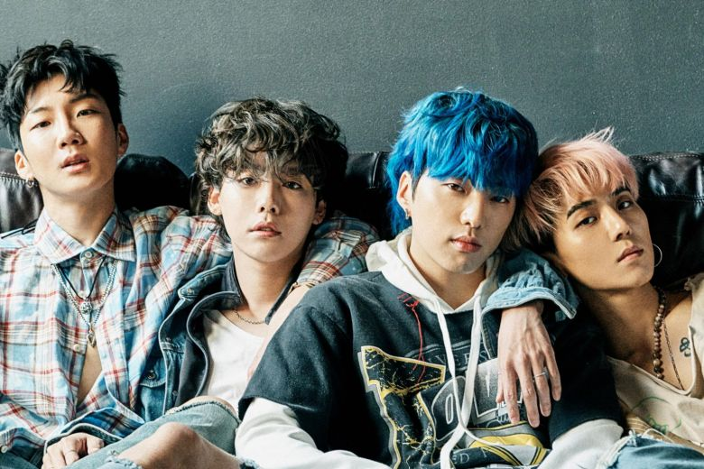

我们还要养猫猫，可爱的大胖猫，一起抱着它。

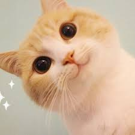

---

### 我要和你把你喜欢的都吃一遍，喝一遍！

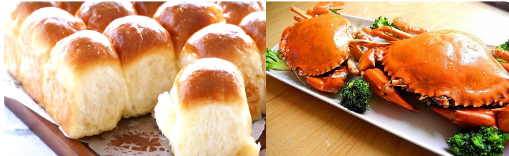

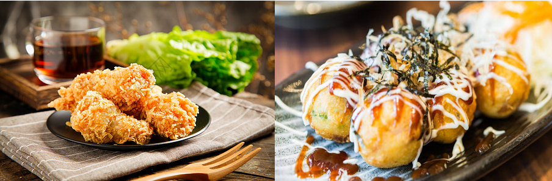

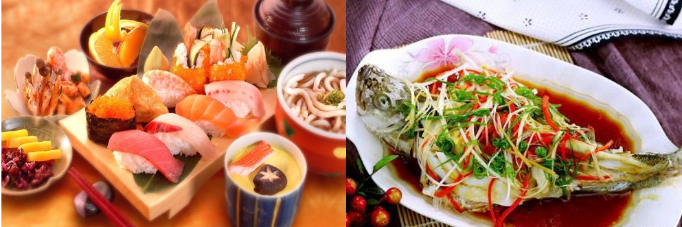

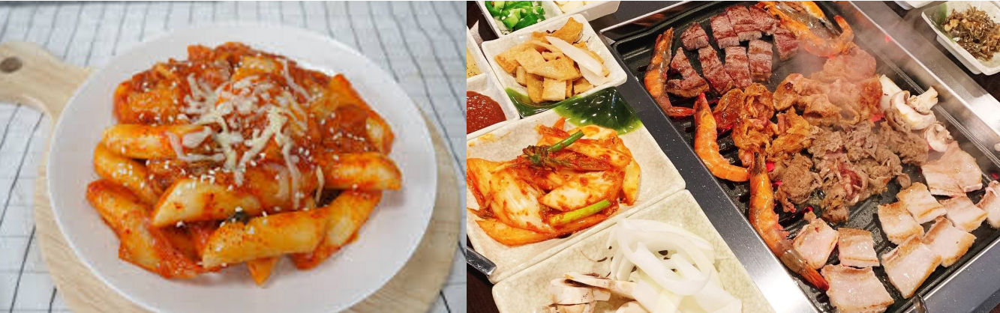

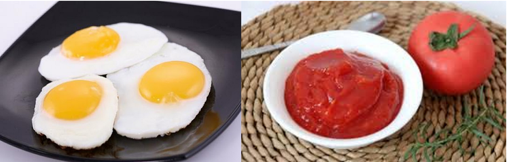

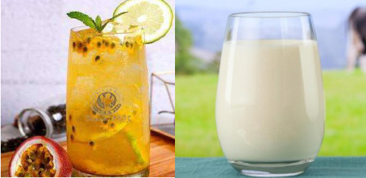

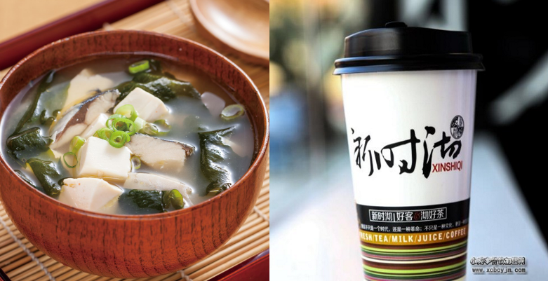

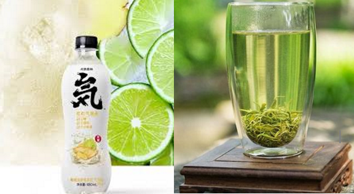

**秋天的晚上，在安静别墅的阳台搂着你坐着，听着你喜欢的WINNER，喝一点小酒，听着外面的雨声，我们都不说话，但是却很美好。**

**生日快乐！我的宝贝！**

